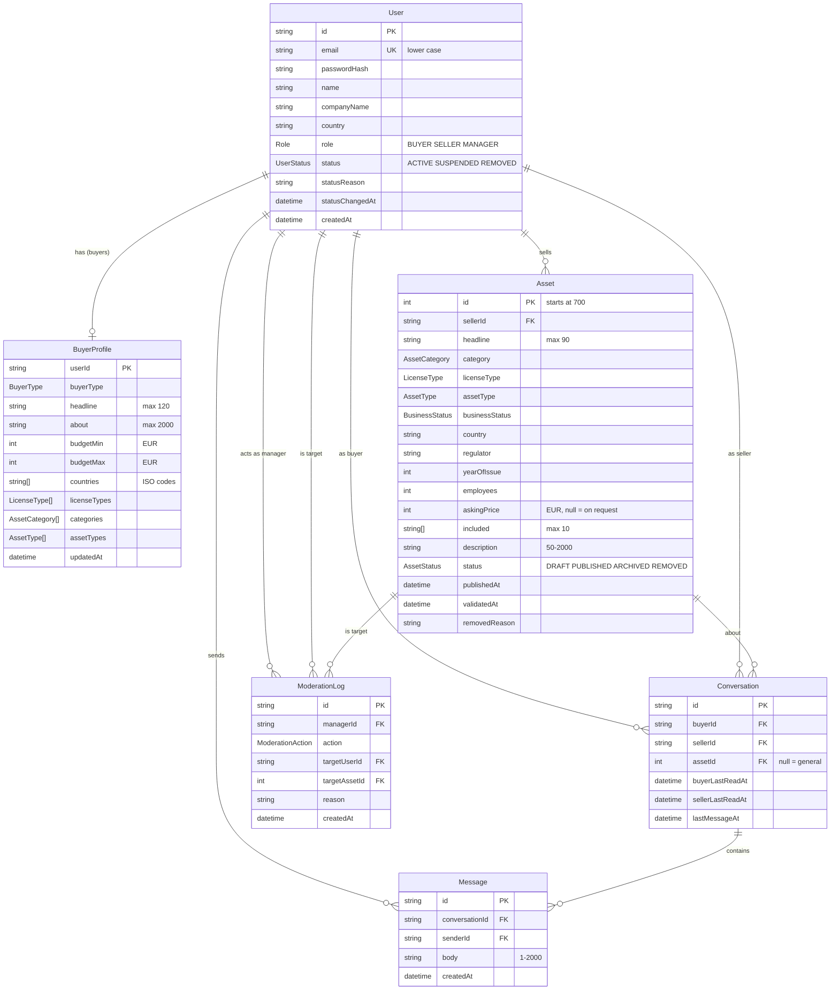

# FDeals - marketplace prototype

A working prototype of a marketplace for M&A opportunities in financial assets (licensed payment institutions, EMIs, crypto/VASP entities, banks). It is built as a take-home assignment, with N5Deal as the product and visual reference.

Three roles share one application:

- **Buyer** describes what they are looking for, browses and filters assets, sees how well each asset matches their interests, and contacts sellers.
- **Seller** publishes and manages assets, browses and filters buyers (optionally ranked against one of their assets), and contacts buyers.
- **Platform manager** sees all participants and all assets, validates assets, suspends or removes participants and assets that do not comply, always with a reason.

**Demo:** `<DEPLOY_URL>` (set before submission)
**Stack:** Next.js (App Router) · TypeScript strict · Prisma 6 · PostgreSQL (Supabase) · Tailwind + shadcn/ui · Vitest · Vercel

## Demo accounts

Every account uses the password **`demo1234`**. They are also listed on the login page, one click fills the form.

| Role | Email | Notes |
|---|---|---|
| Manager | `anna@example.com` | |
| Seller | `seller.malta@example.com` | active, has dialogs |
| Seller | `seller.baltic@example.com` | active, has dialogs |
| Seller | `seller.georgia@example.com` | active |
| Seller | `seller.cyprus@example.com` | **suspended** |
| Seller | `seller.gulf@example.com` | **removed**, cannot log in |
| Buyer | `lukas.weber@example.com` | active, has dialogs, one unread reply |
| Buyer | `sofia.marino@example.com` | active, has a dialog |
| Buyer | `daniel.brooks@example.com` | active, has a dialog |
| Buyer | `amira.khalil@example.com` | active, has a dialog |
| Buyer | `tomasz.nowak@example.com` | active, has a dialog |
| Buyer | `helen.park@example.com`, `viktor.horak@example.com`, `rachel.green@example.com` | active, different interests |
| Buyer | `mark.silva@example.com` | **suspended** |
| Buyer | `irina.kowal@example.com` | active, **empty profile** (hidden from sellers) |

Seed data: 16 users, 10 buyer profiles, 45 assets (#700-#744) in all statuses, 8 conversations with 27 messages, 8 moderation log entries.

## How to explore

1. **Buyer with matches** - log in as `lukas.weber@example.com`.
   - `/assets`: cards show a "Matches N of 5" badge, a green "Strong match" when every criterion he set matches. Hover or focus the badge to see which criteria matched.
   - Turn on **Only my interests**, switch sorting to **Best match**, change filters and reload the page: the state lives in the URL.
   - Open an asset, click **Contact seller**; an existing dialog shows **Open conversation** instead.
   - `/profile`: edit interests, the card preview on the right updates live. Clear all interests and save: the profile becomes hidden from sellers and a hint says so.
2. **Seller with dialogs** - log in as `seller.malta@example.com`.
   - `/buyers`: filter buyers, pick **Match against** one of your assets to rank buyers by fit.
   - `/my-assets`: status tabs with counters. Publish a new asset (live preview, **Save draft** / **Publish asset**), edit, **Withdraw**, **Republish**. A draft can be deleted, a published asset cannot.
   - Open one of your published assets: the **Matching buyers** block lists the top five buyers with links to their profiles.
   - `/messages`: continue a conversation (Enter sends, Shift+Enter inserts a line break).
3. **Manager** - log in as `anna@example.com`.
   - `/admin/users`: tabs with counters, search, row menu. **Suspend** and **Remove** ask for a reason; **Restore** is one click. Managers have no actions (they cannot be suspended or removed, including by themselves).
   - `/admin/assets`: all statuses, filters, **Validate**, **Remove from listings** with a reason.
   - Try moderation on a user you register yourself: **Remove** cannot be undone in the interface.
4. **Suspended user** - log in as `mark.silva@example.com` (buyer) or `seller.cyprus@example.com` (seller). A banner with the reason is shown on every page, all changing actions are disabled, and the server rejects them even if the button is re-enabled in DevTools. Conversation history stays visible, the input is replaced by a notice.
5. **Removed user** - `seller.gulf@example.com` gets "This account has been removed from the platform." on login.
6. **Empty profile** - `irina.kowal@example.com` is not shown to sellers and sees a hint to fill in interests.
7. **Hidden resources are 404, not 403** - as a buyer open the id of a draft or removed asset (visible in a seller's `/my-assets`), or `/admin/users`: the answer is the same "Page not found". Also try `?page=999` on any list.

## Run locally

Requirements: Node.js 22+, npm, a PostgreSQL database (a free Supabase project works; any Postgres is fine for local use).

```bash
npm install
cp .env.example .env          # then fill in the three values below
npm run db:migrate            # applies the migrations (prisma migrate dev)
npm run db:seed               # 16 demo users, 45 assets, 8 conversations
npm run dev                   # http://localhost:3000
```

Environment variables (`.env.example`):

| Variable | Meaning |
|---|---|
| `DATABASE_URL` | Runtime connection. With Supabase: the **transaction pooler** (port 6543) with `?pgbouncer=true&connection_limit=1`. |
| `DIRECT_URL` | Used by migrations. With Supabase: the **session pooler** (port 5432). Do not use the direct `db.<ref>.supabase.co` host, it is IPv6-only. |
| `SESSION_SECRET` | Signs the session token, at least 32 characters. `openssl rand -base64 32` |

Scripts: `dev`, `build` (`prisma generate && prisma migrate deploy && next build`), `start`, `lint`, `typecheck`, `test`, `db:migrate`, `db:seed`, `db:reset` (drops everything and seeds again - destructive).

Checks before a release: `npm run typecheck && npm run lint && npm run test && npm run build`.

Deploy: import the repository in Vercel, set the three variables, deploy. `vercel.json` pins the functions to `fra1`, next to the Supabase region.

## Key technical decisions

- **Next.js full-stack, no separate backend.** Server Components read data, Server Actions write it. One deployment, fewer moving parts, and it matches where N5Deal itself is heading. Every action validates input with a zod schema that the form shares with the server.
- **PostgreSQL on Supabase with Prisma 6.** Prisma gives a typed, reviewable schema and versioned migrations. Version 6 is pinned on purpose: no driver adapters and no `prisma.config.ts`, which keeps the pooler setup simple. The runtime uses the transaction pooler, migrations use the session pooler.
- **Authentication: email and password, bcrypt, signed JWT in an httpOnly cookie** (`jose`, HS256, 7 days, `SameSite=Lax`, `Secure` in production). The token carries only the user id; **the user is loaded from the database on every request**, so suspending or removing someone takes effect immediately and the role is never taken from the client. The login error is the same for an unknown email and a wrong password, and a dummy hash is compared for unknown emails to keep timing uniform. `?next=` accepts only same-origin relative paths.
- **Access rules live in one module** (`src/features/access/visibility.ts`): `where` conditions for every catalog, checks for single pages, contact rules and moderation rules. Queries and actions import from it, pages contain no ad-hoc status checks. Anything a user must not see is a **404**, so existence is not revealed. Hiding a button is only convenience; each Server Action re-checks session, role, user status and ownership.
- **Writes that must not race are conditional.** Status changes use `updateMany` with the status that was checked, and moderation writes the status change and the `ModerationLog` entry in one transaction. Starting a conversation takes an advisory lock per pair and re-reads the other side's status inside the transaction.
- **Soft removal.** Users are never deleted: `REMOVED` hides their content and blocks login. Assets are never physically deleted once published (conversations may refer to them); sellers withdraw them (`ARCHIVED`), managers remove them with a reason (`REMOVED`). Only drafts can be deleted.
- **Postgres arrays for buyer interests** (countries, license types, categories, asset types). The reference lists are small and fixed, filters use `hasSome`, and a GIN index can be added at scale. This avoids four join tables for no gain.
- **Filter, search, sort and page state lives in the URL.** Reload and the back button keep it, links are shareable. Lists never show skeletons after the first load: on a change the old list stays at reduced opacity with a thin progress bar, so nothing jumps.
- **Matching is a pure function** (`features/matching/score.ts`) with tests. A criterion counts only if the buyer set it; a price on request does not take part in the budget. "Best match" sorts in memory over the filtered set (fine for a prototype, see below).
- **Feature-based structure, no DDD or CQRS.** Each feature folder keeps `queries.ts`, `actions.ts`, `schema.ts` and components together; pages stay thin. A deliberate choice for a prototype of this size.
- **Design system.** Tailwind with tokens in `globals.css`, shadcn/ui components recolored to the N5Deal look (pill buttons, 20px cards, black pill for the active nav item). No raw enum values in the UI: labels come from one reference module, prices and dates from one formatting module (dates in UTC, so the server and the browser render the same string).

## Data model



Notes on statuses:

- **User:** `ACTIVE` is normal. `SUSPENDED` can log in and sees a banner with the reason, but cannot change or send anything; their profile and assets are hidden from catalogs and the manager can restore them. `REMOVED` cannot log in and is hidden everywhere; this is irreversible in the interface (in a real system it would be reversible and subject to a data retention policy).
- **Asset:** `DRAFT` (owner and manager only) → `PUBLISHED` (everyone, if the seller is active) ⇄ `ARCHIVED` (withdrawn by the owner, who can republish). `REMOVED` is set by a manager with a reason; the owner sees the reason and cannot edit or republish. `validatedAt` is an independent trust mark ("Validated"), not a publication gate.
- **Conversation** is unique per (buyer, seller, asset). Postgres does not treat two `NULL`s as equal, so the unique index does not cover general conversations (`assetId = null`); that case is checked in code with `findFirst` inside a transaction under an advisory lock.
- The sequence of `Asset.id` is restarted at 700 in the first migration so ids look like the real site ("Asset ID #751").
- `ModerationLog` is written on every moderation action, in the same transaction as the change. There is no page that shows it yet (see below).

## Assumptions

- **A buyer profile is "filled"** when at least one of countries, license types, categories or budget is set. Asset types alone do not count. Buyers with an empty profile are not shown to sellers and see a hint to fill in their interests.
- **Who may contact whom:** a buyer writes to a seller from an asset page, a seller writes to a buyer from the buyer's profile. Buyer-to-buyer, seller-to-seller, to yourself, and anything involving a manager are rejected. Managers do not take part in conversations.
- **Suspended or removed participants** cannot be contacted and cannot contact anyone. Existing conversations keep their history, the input is replaced by a notice.
- **A conversation is per pair and asset:** if one exists, the button reads "Open conversation" instead of creating a second one. A general conversation (no asset) is allowed from the seller side.
- **Assets are published without prior moderation.** "Validated" is a separate, later trust signal given by a manager.
- **A suspended seller's published assets stay in the database as published** but disappear from catalogs while the seller is suspended, and come back on restore.
- **A manager cannot suspend or remove any manager,** including themselves; the server enforces it.
- **Price on request** (`null`) is a first-class value: it is shown as such, sorted last, and does not affect the budget match.
- **Currency is EUR only,** whole euros.
- **A draft needs only a few fields** (headline, category, license type, asset type, business status, country); publishing runs the full validation.
- **Dates are shown in UTC.**

## Edge cases handled

- `?page=999`, `?page=abc`, fractional or huge page numbers: redirect to the last page or fall back to page 1.
- Garbage in any URL parameter (`?sort=garbage`, unknown enum values, non-numeric prices): falls back to defaults, never throws. A price or budget range typed backwards is swapped.
- Non-numeric or foreign ids in asset, buyer and conversation URLs: 404 with the same page as a missing resource.
- Wrong role on a page (a buyer opening `/admin/users`, a seller opening `/assets`): 404.
- `?next=` open redirects (`//evil.com`, `/\t/evil.com`, `/..//evil.com`, backslashes, control characters) are rejected and covered by a test.
- Login: one error for an unknown email and a wrong password; email is stored and compared in lower case; a removed account gets its own message; a suspended one can log in and sees the banner.
- A user suspended or removed while logged in is cut off on the next request (status is read from the database every time). The same is re-checked inside the transaction when sending a message.
- A suspended user cannot change anything even if a disabled button is re-enabled: every Server Action checks the status on the server.
- Concurrent changes: withdrawing, republishing, editing, validating and removing an asset are conditional on the status that was read; a stale write gets "The record has changed, reload the page and try again".
- Double submit: buttons are disabled while an action runs; sending a message is optimistic with a "Sending..." state, and a failed send shows "Not sent" with Retry (also on a lost connection).
- Starting the same conversation twice at once does not create a duplicate (advisory lock plus `findFirst`, because `NULL` is not covered by the unique index).
- A seller whose asset was removed by a manager sees the reason and cannot edit or republish it, also not by calling the action directly.
- A buyer who empties their profile disappears from the sellers' catalog, and a first message to them is rejected if that happens while the seller is writing.
- Long names, headlines and company names are truncated with an ellipsis and the full text in a tooltip; the layout does not shift when lists load, filters change or the "+N" tags expand.
- Every list has an empty state with an action; every destructive action asks for confirmation; every action gives feedback (toast or a visible change).
- Unexpected render errors show an in-app error page with "Try again" instead of the default framework page.

## Tests

`npm run test` runs 25 Vitest tests:

- `matching/score.test.ts` - all criteria match, some match, nothing specified, price on request, budget with only a lower bound.
- `access/visibility.test.ts` - asset visibility by role and status, buyer profile visibility, contact rules, moderation rules.
- `auth/guards.test.ts` - safe redirect paths, including dot-segment bypasses.

There are no end-to-end tests (see below).

## AI tools used

The project was built with **Claude Code** (Anthropic) inside the 24 hours of the assignment. I kept ownership of the product and of every decision:

- **Spec first.** Before writing code I wrote an implementation spec (scope split into MUST / SHOULD / COULD, access rules, data model, screens, design tokens) and a task list with "done when" criteria. The assignment was the source of truth: if the spec contradicted it, work stopped.
- **Task by task.** Claude Code implemented one task at a time through project skills (`/task`, `/phase-check`, `/status`), and I accepted each result before the next one started. A project `CLAUDE.md` and path-scoped rules (access, data, UI) kept it inside the stack, structure and conventions. It was not allowed to add libraries, fields or screens that the spec did not describe.
- **Review by separate agents.** Read-only subagents reviewed the code against the spec: one for access rules (section "Access rules" of the spec), one for UI and design tokens, one for task criteria. They found real problems, for example an open-redirect bypass in `?next=` (`/\t/evil.com`, later `/..//evil.com`), race windows in the messaging transactions, and contrast issues. Each finding was fixed or consciously recorded.
- **Checks.** `typecheck`, `lint`, `build` and tests ran after every task; schema changes only through migrations; destructive database commands were reserved for me.
- **What I verified by hand:** every task's acceptance steps in the browser under the relevant roles, the access rules (404s, suspended and removed accounts), the visual match with n5deal.com, and the production deploy and seed. Decisions and deviations were logged as the work went (kept in a local progress file).

## What I would improve with more time

- **Moderation log page** (`/admin/log`). The data is already written on every action; it was cut for time.
- **AI features:** natural-language search ("licensed EMI in the EU under 5M") turned into filters, smart validation of asset descriptions, and suggested replies.
- **Real authentication:** email verification, password reset, rate limiting and lockout on login, server-side session revocation (today logging out only deletes the cookie and the token lives for 7 days, though a removed user is cut off at once). The demo accounts with a shared password are for review only.
- **Moderation before publication** and reversible user removal with a data retention policy.
- **Realtime and notifications:** live messages, unread counters (the read-tracking fields exist), email notifications.
- **Matching in SQL.** "Best match" sorts in memory over the filtered set; at scale it moves into the query, with a GIN index on the interest arrays. A stored score per (buyer, asset) pair is the next step.
- **Multi-language support** and multi-currency prices.
- **End-to-end tests** (Playwright) for the main flows: contact, publish, moderation, blocked users.
- **A seller profile page** for managers ("View" in the participants table) and bulk moderation actions.
- **Known limitation:** the app layout does not re-render on soft navigation inside a segment, so the suspended banner or the menu can be stale until the next full load if a manager changes the status during a session. Server checks are unaffected.
